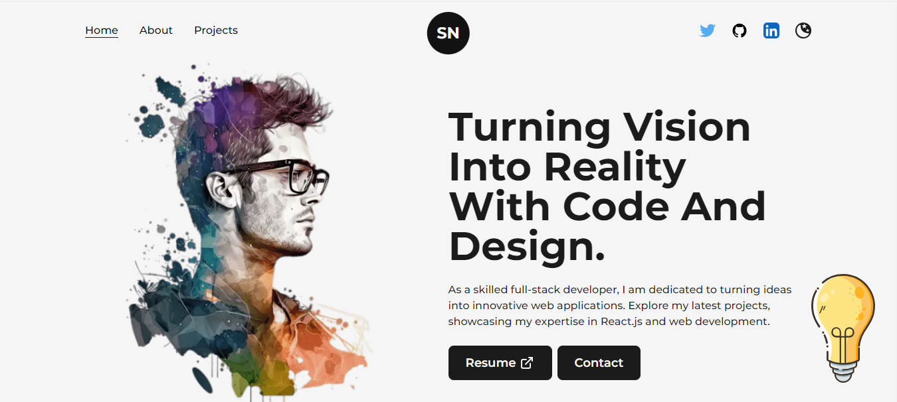
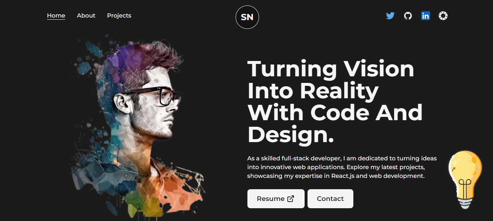
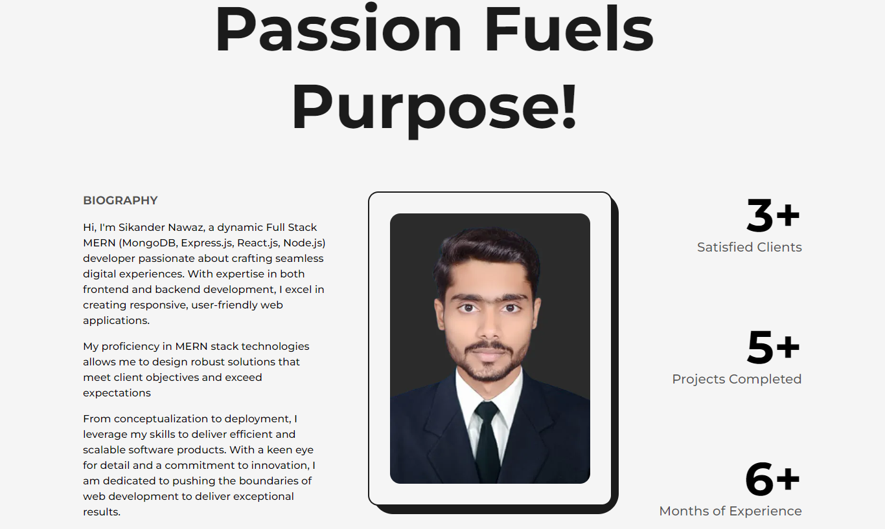
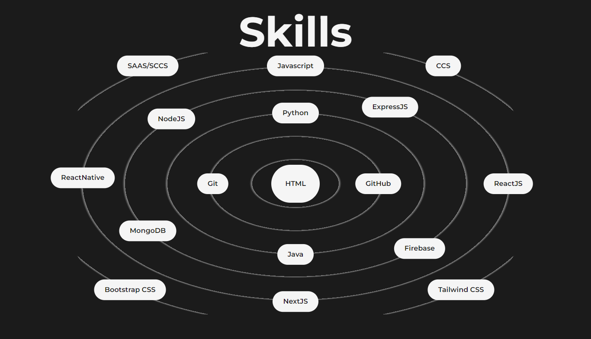
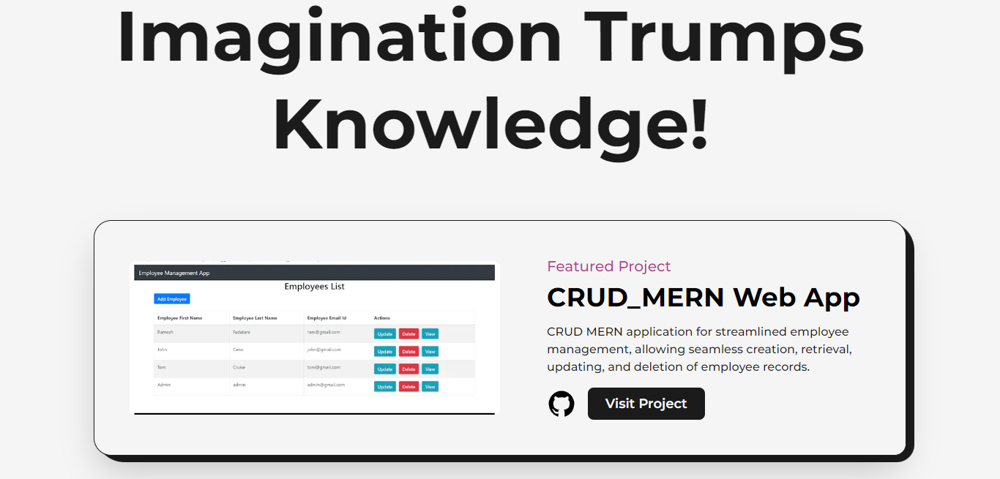
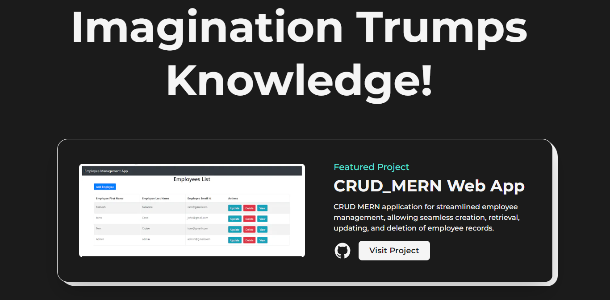

# Portfolio Website with Nextjs, Tailwind CSS and Framer-motion🌟

This portfolio clone from [CodeBucks](https://github.com/codebucks27/Next.js-Developer-Portfolio-Starter-Code) fro educational purpose.

## Images of The Portfolio Website:

## Resources Used in This Project

- Profile image in the home page created by using https://www.midjourney.com/ tool.
- Fonts from https://fonts.google.com/  
- Icons from https://iconify.design/  
- LightBulb Svg from https://lukaszadam.com/illustrations  

## External Libraries used in this project:

- [framer-motion](https://www.framer.com/motion/)  
- [Tailwind css](https://tailwindcss.com/)  
